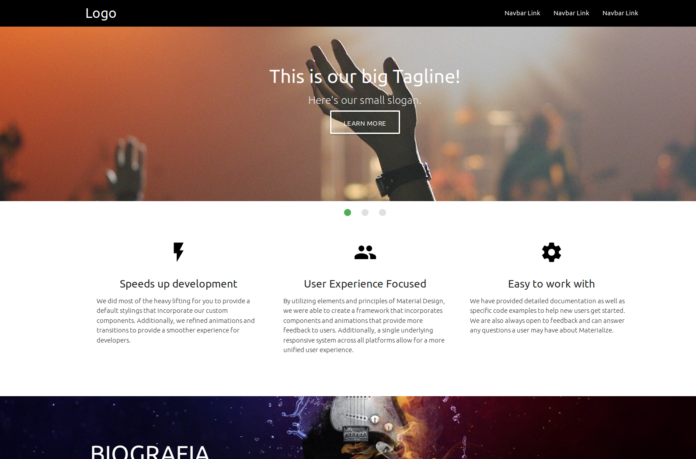
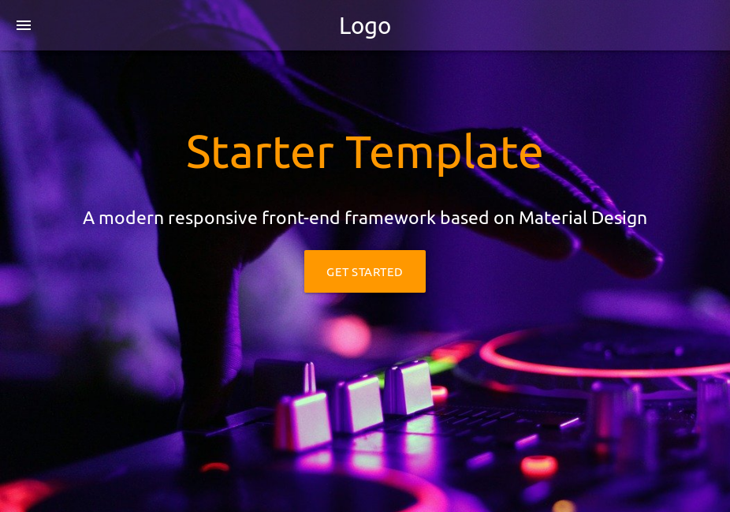
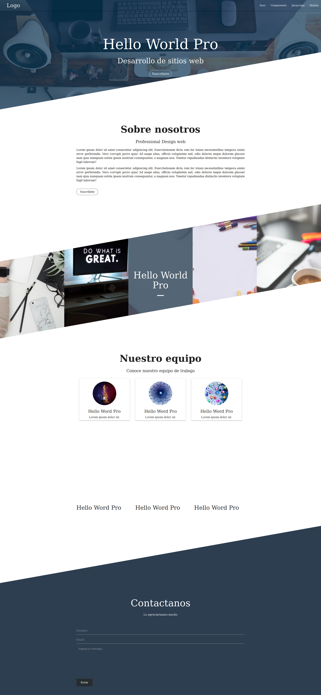

# materialize--plantillas
Plantillas materialize 1.0.0
# materialize-video-fondo

**********************************
# materialize-slider
### slider , imagen de fondo fija y galeria de imagenes.

*********************************
# starter-navbar-transparente
### starter materialize con imagen en background a pagina completa y navbar transparente y opaco al hacer scroll.

**********************************
# materialize-web-Skew
### materialize web con el increible efecto Skew y navbar transparente.

## recursos
* overlay: https://pinetools.com/overlay-images
* css3maker: https://www.css3maker.com
* editor-online: https://codepen.io
* Transform css Generator: https://html-css-js.com/css/generator/transform/
